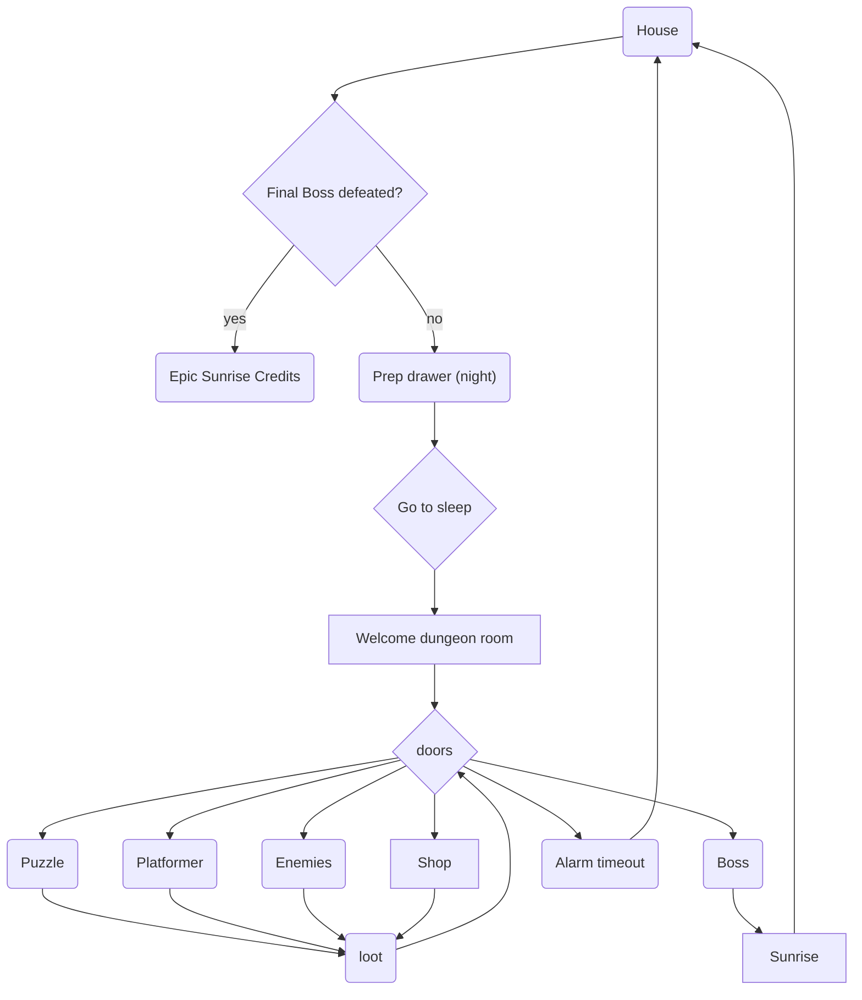

# dream sickle

a ShovelJam submission done in 10 days with the just-get-started theme

# Gameflow

```mermaid
flowchart TD
	H(House) --> W{Final Boss defeated?} -- yes --> EpicSunrise("Epic Sunrise Credits")
	W -- no --> prep("Prep drawer (night)")
	prep --> sleep{"Go to sleep"}
	sleep --> w["Welcome dungeon room"] --> doors{doors}
	loot(loot)
	doors --> D(Puzzle) --> loot
	doors --> P(Platformer) --> loot
	doors --> Enemies(Enemies) --> loot
	doors --> Boss(Boss) --> Sunrise --> H
	doors --> Shop --> loot
	doors --> Alarm("Alarm timeout") --> H
	loot --> doors
```
